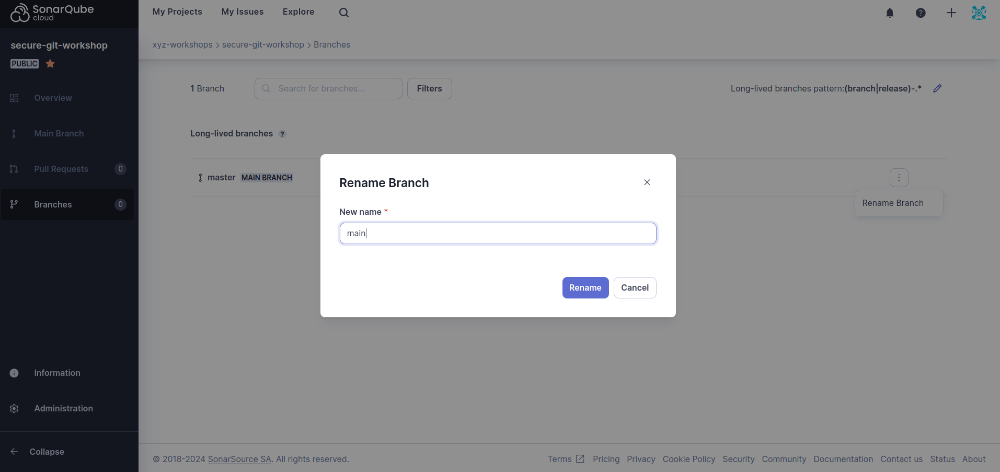

## step4 - static analysis

### 1. What is static analysis ?
```
- Static Application Security Testing (SAST)
- Analyze application source code, byte code and binaries for coding and design conditions that are indicative of security vulnerabilities.
```

### 2. Create SonarCloud account and organization

Access the following links (the first to create an account or login, and the second to create a new organization):
```
https://www.sonarsource.com/products/sonarcloud/signup
https://sonarcloud.io/create-organization
```

On the second link, you must **create an organization manually**. Then, give it any name you want and choose the **free plan**. At the end, click `create`.


### 3. Create a new project and generate a token

On the new page you are redirected to click [Analyze a new project](https://sonarcloud.io/projects/create):
- On the [Analyze projects](https://sonarcloud.io/projects/create) page, give any display name you want, and the project key will be automatically defined. Moreover, leave the project visibility as public. At the end, click the `Next button`
- In the following page (`Set up project for Clean as You Code`), select the `Previous version` option. At the end, click `Create project`.


### 4. Setup analysis

After creating a new project, you will be redirected to a page called `Choose your Analysis Method`. Here, you need to click on the option `With GitHub Actions`.
In the new page, you will receive some instructions on how to setup the GitHub Action for your automatic static analysis pipeline:
- First, copy the given token and set it up on your repository as specified.
- On the step `Create or update a build file`, choose the `Other` option, as this repository has Python code to be analysed.
    - In this step, you will be given instructions regarding the creation of two files. These two files are already created in this branch, you only have to copy and paste.
    - On the GitHub workflows file, you must **change the branch from master to step4** as follows:
        ```yaml
        name: Build
        on:
          push:
            branches:
              - step4
        ...
        ```

As a final step, you need to access the `Branches` page (on the side menu), and update the long-lived branch from `master` to `main`, as follows:



**Don't forget to commit and push your local code!**

### 5. Check the analysis results

After pushing the new workflow, it will be executed by GitHub. After some time, you will have a new branch corresponding to `step4` on the `Branches` page in SonarCloud. If everything is working correctly, it will show you an issue.

However, there are no security issues. For you to check the automatic analysis of security problems, you can force your Python code to have one. Perhaps, change the `get_weather.py` code as follows (line 24):
```python
   r = requests.get(url, verify=False)      # This will make an HTTP request without verifying the certificates
```
After committing and pushing this new update, check the SonarCloud results. What can you conclude?


### Your done 👍 move to step 5
```bash
git checkout step5
```
